# Gold data model — ER diagram & join guide

The entity-relationship map of the **Gold** layer (the consumption contract for
both Looker Studio and the React dashboard) plus the conformed dimensions that
join to it. Use this to answer "what tables are there and how do I join them?"
without reading every `dbt/models/gold/*.sql`.

Grains and columns below are the authoritative ones from `dbt/models/gold/_gold.yml`
and `dbt/models/core/_core.yml`; the diagram shows **key columns + a representative
few**, not every column (each fact carries the full
`val_yearfx_{brl,usd,eur}` nominal + `val_real_{ipca,igpm,igpdi}_{brl,usd,eur}`
deflated value matrix — see [§ Value columns](#value-columns)).

## ER diagram

```mermaid
erDiagram
    gold_commodity_crosswalk ||--o{ gold_pevs_production : "source=pevs · code=product_code"
    gold_commodity_crosswalk ||--o{ gold_pam_production  : "source=pam · code=product_code"
    gold_commodity_crosswalk ||--o{ gold_comex_flows     : "source=comex · code=ncm_code"
    gold_commodity_crosswalk ||--o{ gold_comtrade_flows  : "source=comtrade · code=cmd_code"
    dim_geo_br               ||--o{ gold_pevs_production : "state_acronym"
    dim_geo_br               ||--o{ gold_pam_production  : "state_acronym"
    dim_geo_br               ||--o{ gold_comex_flows     : "state_acronym (UF of NCM)"
    dim_code_industrialization_scd2  |o--o| gold_commodity_crosswalk : "(source, code) · is_current (gated)"

    gold_pevs_production {
        int      reference_year     PK
        string   state_acronym      PK "→ dim_geo_br"
        string   city_code          PK "IBGE 7-digit municipality"
        string   product_code       PK "→ crosswalk.code"
        date     reference_date         "Dec 31 of year"
        string   family                 "massa / volume / … — never SUM qty_base across families"
        float    qty_base               "qty_native to the family base_unit (t / m3 / …)"
        float    val_real_ipca_brl      "deflated R$; plus the full val_ matrix"
        string   data_quality_flag      "OK / MISSING_VALUE / MISSING_QUANTITY / INCOMPLETE"
        timestamp last_refresh
    }
    gold_pam_production {
        int      reference_year     PK
        string   state_acronym      PK "→ dim_geo_br"
        string   city_code          PK "IBGE 7-digit municipality"
        string   product_code       PK "→ crosswalk.code"
        date     reference_date         "Dec 31 of year"
        string   family                 "massa / volume / … — never SUM qty_base across families"
        float    qty_base               "qty_native to the family base_unit (t / m3 / …)"
        float    area_planted_ha        "PAM-only: planted area (ha)"
        float    area_harvested_ha      "PAM-only: harvested area (ha)"
        float    yield_kg_ha            "PAM-only: yield (kg/ha)"
        float    val_real_ipca_brl      "deflated R$; plus the full val_ matrix"
        string   data_quality_flag      "OK / MISSING_VALUE / MISSING_QUANTITY / INCOMPLETE"
        timestamp last_refresh
    }
    gold_comex_flows {
        string   flow               PK "export / import"
        int      reference_year     PK
        int      reference_month    PK
        string   ncm_code           PK "8-digit NCM → crosswalk.code"
        string   country_code       PK "MDIC CO_PAIS"
        string   state_acronym      PK "UF of NCM → dim_geo_br (may be EX/ND/ZN)"
        string   transport_route_code PK "CO_VIA (the `via` filter)"
        string   country_iso_a3         "for choropleths"
        string   family                 "plus qty_base per the statistical unit"
        float    val_real_ipca_brl      "US$ FOB origin; plus val_freight_usd / val_insurance_usd (import)"
        string   data_quality_flag
        timestamp last_refresh
    }
    gold_comtrade_flows {
        string   flow               PK "export / import / re-export / re-import"
        int      reference_year     PK
        string   reporter_code      PK "M49 (origin for exports)"
        string   partner_code       PK "M49 — never '0' (World dropped in Silver)"
        string   cmd_code           PK "HS6 → crosswalk.code"
        string   reporter_iso_a3
        string   partner_iso_a3
        bool     partner_is_group       "true = aggregate area (…, nes)"
        float    net_weight_kg          "always-massa; qty_base often NULL (ch.44)"
        float    val_real_ipca_brl      "US$ primaryValue origin; plus val_cif_usd / val_fob_usd"
        string   data_quality_flag
        timestamp last_refresh
    }
    gold_commodity_crosswalk {
        string   source             PK "pevs / comex / comtrade"
        string   code               PK "PEVS code / NCM8 / HS6"
        string   commodity_id           "stable slug (castanha_do_para, …)"
        string   commodity_name
    }
    dim_geo_br {
        string   state_acronym      PK "27 UFs"
        string   state_name
        string   region                 "Norte / Nordeste / Centro-Oeste / Sudeste / Sul"
        string   region_abbrev          "N / NE / CO / SE / S (frontend ufData)"
    }
    dim_code_industrialization_scd2 {
        string   source             PK
        string   code               PK
        string   industrialization_level "bruta / processada / misturado"
        int      version
        bool     is_current
    }
    gold_source_metadata {
        string   source             PK "ibge_pevs / ibge_pam / ibge_ppm / mdic_comex / un_comtrade"
        string   gold_table
        string   cadence                "annual / monthly"
        int      year_start
        int      year_end
        int      total_rows
        int      products_total
        int      ufs_total              "NULL for COMTRADE"
        timestamp last_refresh
    }
```

> `gold_source_metadata` has no foreign key to the facts — it is **one row per
> source**, a provenance summary aggregated from each fact table (it backs the
> dashboard's `dataStore.meta(id)` page hero). It is drawn standalone above.

## Join cheat-sheet

- **Same commodity across sources** → join each fact's product code to
  `gold_commodity_crosswalk` on `(source, code)` where `code` is `product_code`
  (PEVS) / `ncm_code` (COMEX) / `cmd_code` (COMTRADE), then group by
  `commodity_id`. Codes matching no commodity are simply absent ("unlinked").
- **Brazilian geography** → join `state_acronym` to `dim_geo_br` for
  `state_name` / `region` / `region_abbrev`. (COMTRADE is country↔country — no UF.)
- **Curated industrialization level** (bruta/processada) → `dim_code_industrialization_scd2`
  on `(source, code)` filtered to `is_current`. A VIEW **gated** behind
  `dbt build --vars 'enable_curation: true'` (absent on a fresh project — LEFT
  JOIN so rows survive without a classification).
- **Calendar labels** (pt-BR month names) → the serving marts join `dim_date` on
  the month; the Gold facts already carry `reference_date` inline.

## Medallion lineage

```mermaid
flowchart LR
    subgraph sources["External sources"]
        ibge["IBGE PEVS (SIDRA)"]
        pam["IBGE PAM (SIDRA)"]
        bcb["BCB SGS (FX + inflation)"]
        comex["MDIC Comex Stat"]
        comtrade["UN Comtrade"]
    end
    sources -->|"embrapa ingest (Python)"| bronze["Bronze<br/>append-only, all-STRING"]
    bronze -->|"dbt (dedup on natural key)"| silver["Silver<br/>typed, conformed"]
    silver -->|"dbt (1 table per source)"| gold["Gold<br/>gold_*_production / _flows<br/>+ crosswalk + source_metadata"]
    core["core/ dims<br/>dim_date · dim_geo_br · SCD2"] --> gold
    gold -->|"pre-aggregated marts"| serving["Serving marts<br/>serving_*"]
    serving --> react["React SPA + Flask BFF<br/>(Pushdown Computing)"]
    gold --> looker["Looker Studio<br/>(direct on Gold)"]
    research["research_inputs<br/>curation logs (append-only)"] -->|"SCD2 view"| core
```

## Serving marts (Pushdown Computing)

Pre-aggregated derivations of the Gold facts at the exact chart grains, so the
dashboard scans MB not GB. They derive **from** Gold, they don't replace it.

| Mart | Grain | From | Backs |
|------|-------|------|-------|
| `serving_pevs_annual` | year × UF × product × family | `gold_pevs_production` (municipality dropped) | overviewTS / productTS / ufData |
| `serving_pam_annual` | year × UF × product × family | `gold_pam_production` (municipality dropped) | overviewTS / productTS / ufData |
| `serving_ppm_annual` | year × UF × product × family | `gold_ppm_production` (municipality dropped; carries `measure_kind`) | overviewTS / productTS / ufData |
| `serving_comex_annual` | year × flow × NCM × UF × country | `gold_comex_flows` (month + via dropped) | overview / product / uf / partner / flow |
| `serving_comex_seasonality` | year × **month** × flow × NCM × UF | `gold_comex_flows` (joins `dim_date`; country + via dropped) | seasonality (the only mart keeping month) |
| `serving_comtrade_annual` | year × flow × cmd × reporter × partner | `gold_comtrade_flows` (column-pruned) | partner / flow / market-share |
| `serving_quality_by_source` | source × data_quality_flag (+ share) | all four Gold facts | quality donut |

## Value columns

Every fact carries the same value matrix (chosen server-side by the BFF's
currency × correction convention):

- `val_yearfx_{brl,usd,eur}` — **nominal**, at the FX of the record's period.
- `val_real_ipca_{brl,usd,eur}` / `val_real_igpm_*` / `val_real_igpdi_*` —
  **deflated to today** via the respective BCB chain index, optionally converted
  to a foreign currency at today's FX. Use these for cross-year comparison.
- Trade extras: `val_freight_usd` / `val_insurance_usd` (COMEX imports),
  `val_cif_usd` / `val_fob_usd` (COMTRADE).

> **Physical-unit rule:** `qty_base` is comparable **only within a `family`**
> (massa/volume/energia/contagem/area). NEVER `SUM(qty_base)` across families.
> `net_weight_kg` (always massa) is the cross-family-comparable weight.

See [`ARCHITECTURE.md`](../ARCHITECTURE.md) for the full data-flow narrative and
`docs/frontend_data_contract.md` for the Gold→frontend field contract.
